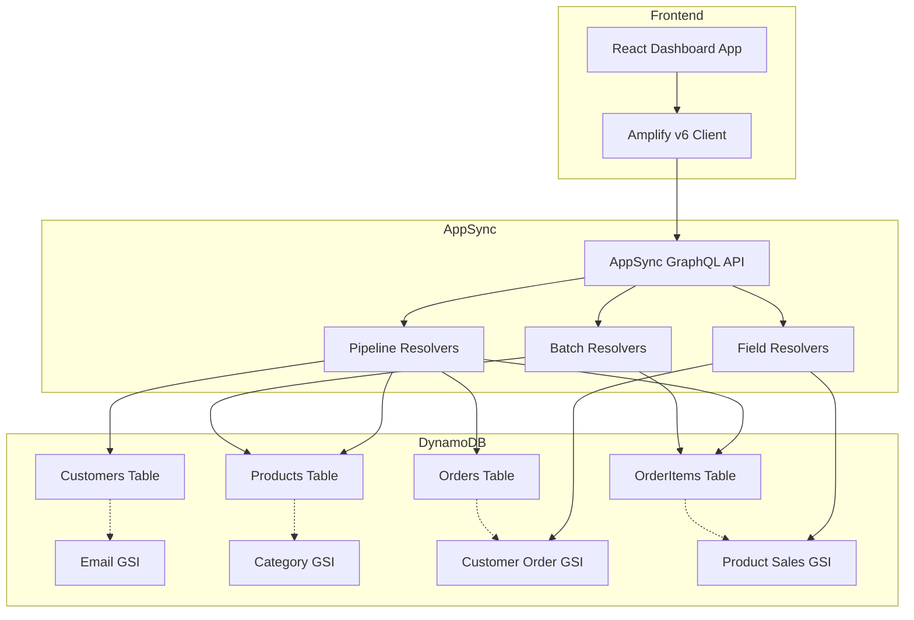
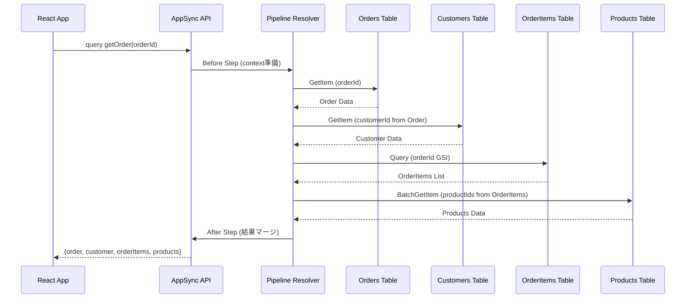
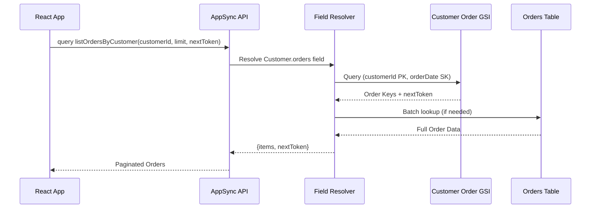
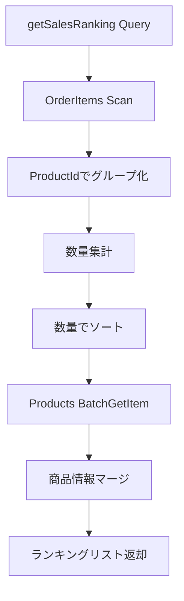

# Technical Design Document

## Overview

本機能は、AWS AppSyncとDynamoDBを組み合わせた、複数テーブルにまたがるデータを効率的にクエリできるGraphQL APIと、そのAPIを活用したECサイトダッシュボードを提供する。DynamoDBはSQLジョインをサポートしないため、AppSyncのパイプラインリゾルバーとフィールドリゾルバーを活用してマルチテーブルデータ集約を実現する。

**Purpose**: DynamoDBのマルチテーブル設計とAppSyncのリゾルバーパターンを習得し、サーバーレスアーキテクチャにおける複雑なデータ関係の処理方法を学習する。

**Users**: AWSサーバーレスアーキテクチャを学習する開発者が、GraphQL APIを通じて顧客管理、商品カタログ、注文管理、ダッシュボード分析機能を利用する。

**Impact**: ゼロからグリーンフィールドプロジェクトとして構築され、pnpm workspacesベースのmonorepo構成、AWS CDKによるインフラ管理、React + TypeScriptフロントエンドを含む包括的なサーバーレスアプリケーションを実現する。

### Goals

- 正規化されたDynamoDB 4テーブル構成でECサイトデータモデルを実装
- AppSync Pipeline Resolversによるマルチテーブルデータ結合パターンを確立
- N+1クエリ問題をBatch Resolversで解決
- GSIを活用した効率的なクエリパターン(顧客検索、カテゴリフィルタ、注文履歴)を実装
- AWS CDK TypeScriptによるインフラ全体のコード管理
- React + Vite + AWS Amplify v6クライアントによる型安全なフロントエンド実装

### Non-Goals

- 本番環境向けの高度な認証・認可(Cognito User Pools)の実装(API_KEYで簡略化)
- リアルタイムサブスクリプション機能(将来拡張として残す)
- シングルテーブル設計パターンの実装(学習目的のためマルチテーブルを採用)
- CloudFrontによるCDN配信(S3静的ホスティングで十分)
- マルチリージョン展開(単一リージョンで構成)

## Architecture

### Architecture Pattern & Boundary Map

**選択パターン**: **Layered Architecture (3-Layer)**

**理由**: 学習目的のプロジェクトには、シンプルで直感的な3層アーキテクチャが最適。AppSync公式サンプルで広く採用されており、サーバーレス環境との親和性が高い。Hexagonal Architectureは本プロジェクトの規模に対して過度に複雑であり、Event-Drivenは最終整合性の管理が困難なため不採用。

**アーキテクチャ統合**:
- Presentation Layer: AppSync GraphQL API + React Frontend
- Business Logic Layer: AppSync Resolvers (Pipeline/Field Resolvers)
- Data Access Layer: DynamoDB Tables + GSI

**ドメイン境界**:
- **Customer Domain**: 顧客情報管理、メールアドレス検索
- **Product Domain**: 商品カタログ管理、カテゴリフィルタリング
- **Order Domain**: 注文管理、注文詳細取得、顧客別注文検索
- **Analytics Domain**: 売上サマリー、商品ランキング、顧客統計

**既存パターン維持**: なし(グリーンフィールドプロジェクト)

**新規コンポーネント理由**:
- **Pipeline Resolver**: DynamoDBのジョイン制約を克服し、マルチテーブルデータ結合を実現
- **GSI**: 非キー属性によるクエリパターン(email検索、カテゴリフィルタ、顧客別注文)を効率化
- **Amplify v6 Client**: AWS公式推奨ライブラリによる型安全性と開発効率の向上



### Technology Stack

| Layer | Choice / Version | Role in Feature | Notes |
|-------|------------------|-----------------|-------|
| Frontend | React 18 + TypeScript 5.x + Vite 5.x | ダッシュボードUI実装 | 高速なHMR、最新のビルドツール |
| GraphQL Client | AWS Amplify v6 | AppSync API接続、型安全なクエリ実行 | 公式推奨、自動型生成、認証統合 |
| Backend / API | AWS AppSync (APPSYNC_JS Runtime) | GraphQL APIエンドポイント、マルチテーブルリゾルバー | JavaScriptランタイムでVTLより可読性向上 |
| Data / Storage | Amazon DynamoDB (On-Demand) | NoSQLデータベース、GSIによる柔軟なクエリ | キャパシティ自動スケーリング、削除保護有効 |
| Infrastructure | AWS CDK v2 (TypeScript) | Infrastructure as Code | L2 Constructsで抽象化、型安全なインフラ定義 |
| Development Tools | pnpm 9.x + Biome 1.x | Monorepoパッケージ管理、リント・フォーマット | 高速インストール、ESLint/Prettier代替 |

**詳細な技術選定理由は`research.md`を参照**。

## System Flows

### Flow 1: 注文詳細取得 (Pipeline Resolver)

複数テーブルにまたがる注文詳細を1回のGraphQLクエリで取得する。



**Key Decisions**:
- OrderとCustomerは1:1なのでGetItem
- OrderItemsは1:Nなのでクエリ実行
- ProductsはBatchGetItemでN+1問題を回避

### Flow 2: 顧客別注文検索 (GSI Query)

顧客IDによる注文検索とページネーション。



**Key Decisions**:
- GSIのProjectionをALLに設定し、追加クエリを回避
- nextTokenによるページネーション実装

### Flow 3: 商品ランキング生成 (Analytics Query)

売上数量でソートされた商品ランキングを集計。



**Key Decisions**:
- OrderItemsテーブル全体をScanし、リゾルバー内で集計
- 商品情報はBatchGetItemで効率的に取得
- 将来的にはDynamoDB Streamsで集計テーブルを事前計算可能

## Requirements Traceability

| Requirement | Summary | Components | Interfaces | Flows |
|-------------|---------|------------|------------|-------|
| 1.1 | 4つのDynamoDBテーブル定義 | DynamoDBStack | DynamoDB Tables | - |
| 1.2 | Customers GSI (email) | CustomersTable | EmailGSI | - |
| 1.3 | Products GSI (category) | ProductsTable | CategoryGSI | - |
| 1.4 | Orders GSI (customerId, orderDate) | OrdersTable | CustomerOrderGSI | Flow 2 |
| 1.5 | OrderItems GSI (productId) | OrderItemsTable | ProductSalesGSI | Flow 3 |
| 1.6 | DynamoDBキャパシティ設定 | DynamoDBStack | BillingMode: ON_DEMAND | - |
| 1.7 | 削除保護有効化 | DynamoDBStack | RemovalPolicy: RETAIN | - |
| 2.1 | GraphQLスキーマ定義 | AppSyncStack | schema.graphql | - |
| 2.2 | DynamoDBデータソース設定 | AppSyncStack | DynamoDbDataSource | - |
| 2.3 | API_KEY認証 | AppSyncStack | AuthorizationMode | - |
| 2.4 | スキーマ更新時の型再生成 | AmplifyCodegen | generateClient() | - |
| 2.5 | CORS設定 | AppSyncStack | CORS Headers | - |
| 2.6 | CloudWatch Logs | AppSyncStack | LogConfig | - |
| 3.1 | 注文詳細のマルチテーブル結合 | getOrderPipeline | Pipeline Resolver | Flow 1 |
| 3.2 | 顧客の注文リスト遅延読み込み | Customer.orders | Field Resolver | Flow 2 |
| 3.3 | カテゴリフィルタリング | listProductsByCategory | CategoryGSI Query | - |
| 3.4 | N+1問題回避 | OrderItems Resolver | BatchGetItem | Flow 1 |
| 3.5 | GSIクエリ失敗時のエラー | All Resolvers | Error Handling | - |
| 4.1-4.6 | 顧客管理機能 | CustomerResolvers | Query/Mutation | - |
| 5.1-5.6 | 商品カタログ管理 | ProductResolvers | Query/Mutation | - |
| 6.1-6.7 | 注文管理機能 | OrderResolvers | Query/Mutation/Pipeline | Flow 1 |
| 7.1-7.6 | ダッシュボード分析 | AnalyticsResolvers | Query | Flow 3 |
| 8.1-8.6 | インフラ管理(CDK) | CDKStack | CDK Constructs | - |
| 9.1-9.8 | フロントエンドダッシュボード | ReactApp | React Components | - |
| 10.1-10.6 | 開発環境とツール | Monorepo Config | pnpm + Biome | - |

## Components and Interfaces

### Component Summary

| Component | Domain/Layer | Intent | Req Coverage | Key Dependencies (P0/P1) | Contracts |
|-----------|--------------|--------|--------------|--------------------------|-----------|
| DynamoDBStack | Infrastructure | DynamoDBテーブルとGSI定義 | 1.1-1.7 | AWS CDK DynamoDB (P0) | - |
| AppSyncStack | Infrastructure | AppSync APIとリゾルバー定義 | 2.1-2.6 | AWS CDK AppSync (P0), DynamoDBStack (P0) | API, Service |
| CustomerResolvers | Business Logic | 顧客CRUD操作 | 4.1-4.6 | CustomersTable (P0), EmailGSI (P1) | Service, API |
| ProductResolvers | Business Logic | 商品CRUD操作 | 5.1-5.6 | ProductsTable (P0), CategoryGSI (P1) | Service, API |
| OrderResolvers | Business Logic | 注文CRUD操作 | 6.1-6.7 | OrdersTable (P0), OrderItemsTable (P0), PipelineResolver (P0) | Service, API |
| AnalyticsResolvers | Business Logic | ダッシュボード分析 | 7.1-7.6 | OrdersTable (P1), OrderItemsTable (P1), ProductsTable (P1) | Service, API |
| ReactApp | Presentation | Webダッシュボード | 9.1-9.8 | Amplify v6 (P0), AppSync API (P0) | - |
| AmplifyClient | Integration | GraphQLクライアント | 9.6-9.8 | AWS Amplify v6 (P0) | Service |

---

### Infrastructure

#### DynamoDBStack

| Field | Detail |
|-------|--------|
| Intent | 4つのDynamoDBテーブル(Customers, Products, Orders, OrderItems)とGSIを定義 |
| Requirements | 1.1, 1.2, 1.3, 1.4, 1.5, 1.6, 1.7 |

**Responsibilities & Constraints**
- DynamoDBテーブルのプライマリキー(PK, SK)とGSIキーの定義
- オンデマンド課金モードによるキャパシティ自動スケーリング
- 削除保護設定(RemovalPolicy: RETAIN)で誤削除防止
- GSI Projection TypeはALLに統一し、追加クエリを回避

**Dependencies**
- Outbound: AWS CDK DynamoDB L2 Construct (`aws-cdk-lib/aws-dynamodb`) — テーブル定義 (P0)

**Contracts**: Service [ ]  API [ ]  Event [ ]  Batch [ ]  State [✓]

##### State Management

**Customers Table**
```typescript
{
  tableName: 'Customers',
  partitionKey: { name: 'customerId', type: AttributeType.STRING },
  sortKey: { name: 'customerId', type: AttributeType.STRING },
  billingMode: BillingMode.ON_DEMAND,
  removalPolicy: RemovalPolicy.RETAIN,
  globalSecondaryIndexes: [
    {
      indexName: 'email-gsi',
      partitionKey: { name: 'email', type: AttributeType.STRING },
      projectionType: ProjectionType.ALL
    }
  ]
}
```

**Products Table**
```typescript
{
  tableName: 'Products',
  partitionKey: { name: 'productId', type: AttributeType.STRING },
  sortKey: { name: 'productId', type: AttributeType.STRING },
  billingMode: BillingMode.ON_DEMAND,
  removalPolicy: RemovalPolicy.RETAIN,
  globalSecondaryIndexes: [
    {
      indexName: 'category-gsi',
      partitionKey: { name: 'category', type: AttributeType.STRING },
      projectionType: ProjectionType.ALL
    }
  ]
}
```

**Orders Table**
```typescript
{
  tableName: 'Orders',
  partitionKey: { name: 'orderId', type: AttributeType.STRING },
  sortKey: { name: 'orderId', type: AttributeType.STRING },
  billingMode: BillingMode.ON_DEMAND,
  removalPolicy: RemovalPolicy.RETAIN,
  globalSecondaryIndexes: [
    {
      indexName: 'customer-order-gsi',
      partitionKey: { name: 'customerId', type: AttributeType.STRING },
      sortKey: { name: 'orderDate', type: AttributeType.STRING },
      projectionType: ProjectionType.ALL
    }
  ]
}
```

**OrderItems Table**
```typescript
{
  tableName: 'OrderItems',
  partitionKey: { name: 'orderItemId', type: AttributeType.STRING },
  sortKey: { name: 'orderItemId', type: AttributeType.STRING },
  billingMode: BillingMode.ON_DEMAND,
  removalPolicy: RemovalPolicy.RETAIN,
  globalSecondaryIndexes: [
    {
      indexName: 'product-sales-gsi',
      partitionKey: { name: 'productId', type: AttributeType.STRING },
      projectionType: ProjectionType.ALL
    }
  ]
}
```

**Persistence & Consistency**: オンデマンド課金モードによりWCU/RCUの手動調整不要、GSIは結果整合性(Eventually Consistent)

**Concurrency Strategy**: DynamoDBのオプティミスティック同時実行制御は不使用(単一ユーザー学習環境のため)

**Implementation Notes**
- **Integration**: CDKスタックデプロイ時にテーブル作成、削除保護により誤削除防止
- **Validation**: GSIキー属性がテーブル属性に存在することをCDK合成時に検証
- **Risks**: GSI書き込みキャパシティ不足によるスロットリングリスク → CloudWatch Alarmsで監視

---

#### AppSyncStack

| Field | Detail |
|-------|--------|
| Intent | AppSync GraphQL APIとリゾルバー(Pipeline/Field/Batch)を定義 |
| Requirements | 2.1, 2.2, 2.3, 2.4, 2.5, 2.6 |

**Responsibilities & Constraints**
- GraphQLスキーマファイル(`schema.graphql`)の読み込みとAPI構成
- DynamoDBデータソースの接続とIAMロール自動生成
- API_KEY認証モード設定(学習目的、本番ではCognito推奨)
- APPSYNC_JSランタイムによるリゾルバー実装
- CloudWatch Logsロギング(DEBUGレベル)有効化

**Dependencies**
- Inbound: ReactApp (Amplify Client) — GraphQLクエリ実行 (P0)
- Outbound: DynamoDBStack (4 Tables) — データCRUD操作 (P0)
- External: AWS AppSync L2 Construct (`aws-cdk-lib/aws-appsync`) — API定義 (P0)

**Contracts**: Service [✓]  API [✓]  Event [ ]  Batch [ ]  State [ ]

##### Service Interface

```typescript
interface AppSyncStackProps extends StackProps {
  customersTable: Table;
  productsTable: Table;
  ordersTable: Table;
  orderItemsTable: Table;
}

class AppSyncStack extends Stack {
  public readonly api: GraphqlApi;
  public readonly apiUrl: CfnOutput;
  public readonly apiKey: CfnOutput;

  constructor(scope: Construct, id: string, props: AppSyncStackProps) {
    // GraphQL API作成
    // データソース接続
    // リゾルバー定義
  }
}
```

- **Preconditions**: DynamoDBテーブルが存在すること
- **Postconditions**: AppSync APIエンドポイントとAPIキーがCfnOutputで出力される
- **Invariants**: API_KEY認証モードが有効、CloudWatch Logsが有効

##### API Contract

**GraphQL Schema Overview** (詳細は`schema.graphql`参照)

```graphql
type Query {
  # 顧客管理
  listCustomers(limit: Int, nextToken: String): CustomerConnection!
  getCustomer(customerId: ID!): Customer
  searchCustomerByEmail(email: String!): Customer

  # 商品カタログ
  listProducts(limit: Int, nextToken: String): ProductConnection!
  getProduct(productId: ID!): Product
  listProductsByCategory(category: String!, limit: Int, nextToken: String): ProductConnection!

  # 注文管理
  listOrders(limit: Int, nextToken: String): OrderConnection!
  getOrder(orderId: ID!): Order
  listOrdersByCustomer(customerId: ID!, limit: Int, nextToken: String): OrderConnection!

  # ダッシュボード分析
  getSalesSummary: SalesSummary!
  getProductRanking(limit: Int): [ProductRanking!]!
  getCustomerStats: CustomerStats!
}

type Mutation {
  createCustomer(input: CreateCustomerInput!): Customer!
  createProduct(input: CreateProductInput!): Product!
  createOrder(input: CreateOrderInput!): Order!
}

type Customer {
  customerId: ID!
  name: String!
  email: String!
  orders: [Order!]! # Field Resolver
}

type Order {
  orderId: ID!
  customerId: ID!
  customer: Customer! # Pipeline Resolver
  orderDate: String!
  totalAmount: Float!
  orderItems: [OrderItem!]! # Batch Resolver
}
```

**エラーコード**:
- `400 BadRequest`: 入力バリデーションエラー
- `404 NotFound`: リソースが存在しない
- `500 InternalServerError`: DynamoDB操作失敗

**Implementation Notes**
- **Integration**: `schema.graphql`をCDKで読み込み、`SchemaFile.fromAsset()`で設定
- **Validation**: GraphQLスキーマの構文チェックはCDK合成時に実行
- **Risks**: スキーマ変更時のフロントエンド型定義ずれ → Amplify Code Generationで自動同期

---

### Business Logic

#### CustomerResolvers

| Field | Detail |
|-------|--------|
| Intent | 顧客情報のCRUD操作とメールアドレス検索 |
| Requirements | 4.1, 4.2, 4.3, 4.4, 4.5, 4.6 |

**Responsibilities & Constraints**
- 顧客一覧取得(ページネーション対応)
- 顧客ID検索(GetItem)
- メールアドレス検索(GSIクエリ)
- 新規顧客作成(UUID v4自動生成)
- 顧客詳細には注文履歴を含める(Field Resolver)

**Dependencies**
- Outbound: CustomersTable — 顧客データCRUD (P0)
- Outbound: EmailGSI — メールアドレス検索 (P1)
- Outbound: CustomerOrderGSI — 注文履歴取得 (P1)

**Contracts**: Service [✓]  API [✓]  Event [ ]  Batch [ ]  State [ ]

##### Service Interface

```typescript
// APPSYNC_JS Runtime
export function request(ctx: Context): DynamoDBQueryRequest {
  return {
    operation: 'GetItem',
    key: {
      customerId: { S: ctx.arguments.customerId },
      customerId: { S: ctx.arguments.customerId }
    }
  };
}

export function response(ctx: Context): Customer {
  if (ctx.error) {
    util.error(ctx.error.message, ctx.error.type);
  }
  return ctx.result;
}
```

- **Preconditions**: customerIdはUUID v4形式
- **Postconditions**: 顧客が存在しない場合はnullを返す
- **Invariants**: メールアドレスは一意性を保証しない(GSIは複数ヒット可能)

##### API Contract

| Method | Query/Mutation | Request | Response | Errors |
|--------|----------------|---------|----------|--------|
| listCustomers | Query | `{ limit: Int, nextToken: String }` | `CustomerConnection` | 500 |
| getCustomer | Query | `{ customerId: ID! }` | `Customer \| null` | 400, 500 |
| searchCustomerByEmail | Query | `{ email: String! }` | `Customer \| null` | 400, 500 |
| createCustomer | Mutation | `{ input: CreateCustomerInput! }` | `Customer` | 400, 500 |

**Implementation Notes**
- **Integration**: Field Resolver `Customer.orders`で顧客別注文を遅延読み込み
- **Validation**: メールアドレス形式は正規表現で検証(`/^[^\s@]+@[^\s@]+\.[^\s@]+$/`)
- **Risks**: 同一メールアドレスで複数顧客登録可能(一意性制約なし) → ビジネス要件で許容

---

#### ProductResolvers

| Field | Detail |
|-------|--------|
| Intent | 商品カタログのCRUD操作とカテゴリフィルタリング |
| Requirements | 5.1, 5.2, 5.3, 5.4, 5.5, 5.6 |

**Responsibilities & Constraints**
- 商品一覧取得(ページネーション対応)
- 商品ID検索(GetItem)
- カテゴリ別商品検索(GSIクエリ)
- 新規商品作成(UUID v4自動生成)

**Dependencies**
- Outbound: ProductsTable — 商品データCRUD (P0)
- Outbound: CategoryGSI — カテゴリフィルタリング (P1)

**Contracts**: Service [✓]  API [✓]  Event [ ]  Batch [ ]  State [ ]

##### API Contract

| Method | Query/Mutation | Request | Response | Errors |
|--------|----------------|---------|----------|--------|
| listProducts | Query | `{ limit: Int, nextToken: String }` | `ProductConnection` | 500 |
| getProduct | Query | `{ productId: ID! }` | `Product \| null` | 400, 500 |
| listProductsByCategory | Query | `{ category: String!, limit: Int, nextToken: String }` | `ProductConnection` | 400, 500 |
| createProduct | Mutation | `{ input: CreateProductInput! }` | `Product` | 400, 500 |

**Implementation Notes**
- **Integration**: CategoryGSIのProjectionがALLのため、追加クエリ不要
- **Validation**: 価格は正の数値、カテゴリは列挙型(Electronics, Clothing, Books等)で制限
- **Risks**: カテゴリ名の大文字小文字不一致 → 入力時に正規化(toLowerCase)

---

#### OrderResolvers

| Field | Detail |
|-------|--------|
| Intent | 注文管理、注文詳細のマルチテーブル結合、注文作成時の合計金額計算 |
| Requirements | 6.1, 6.2, 6.3, 6.4, 6.5, 6.6, 6.7 |

**Responsibilities & Constraints**
- 注文一覧取得(ページネーション対応)
- 注文ID検索(Pipeline Resolver: Order → Customer → OrderItems → Products)
- 顧客別注文検索(GSIクエリ)
- 新規注文作成(UUID v4自動生成、作成日時記録、合計金額自動計算)

**Dependencies**
- Outbound: OrdersTable — 注文データCRUD (P0)
- Outbound: OrderItemsTable — 注文明細データ (P0)
- Outbound: CustomersTable — 顧客情報取得 (P0)
- Outbound: ProductsTable — 商品情報取得 (P0)
- Outbound: CustomerOrderGSI — 顧客別注文検索 (P1)

**Contracts**: Service [✓]  API [✓]  Event [ ]  Batch [✓]  State [ ]

##### Service Interface (Pipeline Resolver)

```typescript
// Before Step
export function request(ctx: Context) {
  return {
    orderId: ctx.arguments.orderId
  };
}

// Function 1: GetOrder
export function request(ctx: Context): DynamoDBGetItemRequest {
  return {
    operation: 'GetItem',
    key: {
      orderId: { S: ctx.stash.orderId },
      orderId: { S: ctx.stash.orderId }
    }
  };
}

export function response(ctx: Context) {
  if (!ctx.result) {
    util.error('Order not found', 'NotFound');
  }
  ctx.stash.order = ctx.result;
  return ctx.result;
}

// Function 2: GetCustomer
export function request(ctx: Context): DynamoDBGetItemRequest {
  return {
    operation: 'GetItem',
    key: {
      customerId: { S: ctx.stash.order.customerId },
      customerId: { S: ctx.stash.order.customerId }
    }
  };
}

export function response(ctx: Context) {
  ctx.stash.customer = ctx.result;
  return ctx.result;
}

// Function 3: GetOrderItems
export function request(ctx: Context): DynamoDBQueryRequest {
  return {
    operation: 'Query',
    query: {
      expression: 'orderId = :orderId',
      expressionValues: {
        ':orderId': { S: ctx.stash.orderId }
      }
    }
  };
}

export function response(ctx: Context) {
  ctx.stash.orderItems = ctx.result.items;
  return ctx.result.items;
}

// Function 4: BatchGetProducts
export function request(ctx: Context): DynamoDBBatchGetItemRequest {
  const productIds = ctx.stash.orderItems.map(item => item.productId);
  return {
    operation: 'BatchGetItem',
    tables: {
      Products: {
        keys: productIds.map(id => ({ productId: { S: id }, productId: { S: id } }))
      }
    }
  };
}

export function response(ctx: Context) {
  ctx.stash.products = ctx.result.data.Products;
  return ctx.result.data.Products;
}

// After Step
export function request(ctx: Context) {
  return {
    order: ctx.stash.order,
    customer: ctx.stash.customer,
    orderItems: ctx.stash.orderItems,
    products: ctx.stash.products
  };
}
```

- **Preconditions**: orderIdが存在すること
- **Postconditions**: Order、Customer、OrderItems、Productsが全て結合された状態で返却
- **Invariants**: いずれかのステップで失敗した場合、エラーを返し部分データは返さない

##### Batch Contract

- **Trigger**: `getOrder` Queryの実行
- **Input**: `orderId: ID!`
- **Output**: `{ order: Order, customer: Customer, orderItems: [OrderItem], products: [Product] }`
- **Idempotency**: GetItem/Query操作は冪等、再実行しても同一結果

**Implementation Notes**
- **Integration**: Pipeline Resolverの各Functionは独立してテスト可能
- **Validation**: BatchGetItemは最大100アイテムまで(注文明細が100を超える場合は複数回実行)
- **Risks**: Pipeline中のいずれかのステップで失敗すると全体がロールバック → CloudWatch Logsでステップごとのログを確認

---

#### AnalyticsResolvers

| Field | Detail |
|-------|--------|
| Intent | ダッシュボード分析(売上サマリー、商品ランキング、顧客統計) |
| Requirements | 7.1, 7.2, 7.3, 7.4, 7.5, 7.6 |

**Responsibilities & Constraints**
- 売上サマリー取得(総売上、注文数、平均注文額)
- 商品ランキング取得(販売数量でソート)
- 顧客統計取得(総顧客数、アクティブ顧客数)

**Dependencies**
- Outbound: OrdersTable — 注文データ集計 (P1)
- Outbound: OrderItemsTable — 商品販売数集計 (P1)
- Outbound: ProductsTable — 商品情報取得 (P1)
- Outbound: CustomersTable — 顧客数集計 (P1)

**Contracts**: Service [✓]  API [✓]  Event [ ]  Batch [ ]  State [ ]

##### Service Interface

```typescript
// getSalesSummary
export function request(ctx: Context): DynamoDBScanRequest {
  return {
    operation: 'Scan',
    table: 'Orders'
  };
}

export function response(ctx: Context): SalesSummary {
  const orders = ctx.result.items;
  const totalRevenue = orders.reduce((sum, o) => sum + o.totalAmount, 0);
  const orderCount = orders.length;
  const averageOrderValue = orderCount > 0 ? totalRevenue / orderCount : 0;

  return {
    totalRevenue,
    orderCount,
    averageOrderValue
  };
}

// getProductRanking
export function request(ctx: Context): DynamoDBScanRequest {
  return {
    operation: 'Scan',
    table: 'OrderItems'
  };
}

export function response(ctx: Context): ProductRanking[] {
  const orderItems = ctx.result.items;
  const productSales = {};

  orderItems.forEach(item => {
    if (!productSales[item.productId]) {
      productSales[item.productId] = 0;
    }
    productSales[item.productId] += item.quantity;
  });

  const sortedProducts = Object.entries(productSales)
    .sort((a, b) => b[1] - a[1])
    .slice(0, ctx.arguments.limit || 10);

  // BatchGetItem for product details
  return sortedProducts;
}
```

- **Preconditions**: テーブルにデータが存在すること
- **Postconditions**: 集計結果を返却
- **Invariants**: データがない場合は0またはnull配列を返す

**Implementation Notes**
- **Integration**: Scanオペレーションのため、大量データでは非効率 → DynamoDB Streamsで集計テーブルを事前計算(将来拡張)
- **Validation**: 集計ロジックはリゾルバー内で実装(Lambda不使用)
- **Risks**: OrderItemsテーブル全体Scanによるパフォーマンス劣化 → 将来的にはAggregateテーブルを導入

---

### Presentation

#### ReactApp

| Field | Detail |
|-------|--------|
| Intent | Webブラウザでアクセス可能なダッシュボードUI |
| Requirements | 9.1, 9.2, 9.3, 9.4, 9.5, 9.6, 9.7, 9.8 |

**Responsibilities & Constraints**
- 顧客管理ページ(一覧、検索、作成)
- 商品カタログページ(一覧、カテゴリフィルタ、作成)
- 注文管理ページ(一覧、詳細表示、作成)
- ダッシュボード分析ページ(売上サマリー、商品ランキング、顧客統計)
- ローディングインジケーター表示
- エラーハンドリングとユーザー通知

**Dependencies**
- Outbound: AmplifyClient — GraphQLクエリ実行 (P0)
- Outbound: AppSync API — データ取得・更新 (P0)
- External: React 18, Vite 5, TypeScript 5 (P0)

**Contracts**: なし(UIコンポーネント)

**Implementation Notes**
- **Integration**: `amplifyconfiguration.json`をCDK OutputsからViteの`import.meta.env`経由で注入
- **Validation**: TypeScript型定義はAmplify Code Generationで自動生成(`npm run codegen`)
- **Risks**: APIエンドポイント変更時の環境変数更新忘れ → CI/CDで自動反映

---

#### AmplifyClient

| Field | Detail |
|-------|--------|
| Intent | AppSync APIとの型安全な通信を提供 |
| Requirements | 9.6, 9.7, 9.8 |

**Responsibilities & Constraints**
- `generateClient()`でGraphQLクライアント生成
- API_KEY認証ヘッダー自動付与
- GraphQLクエリ・ミューテーションの型安全な実行
- エラーレスポンスのハンドリング

**Dependencies**
- External: AWS Amplify v6 (`aws-amplify`) (P0)

**Contracts**: Service [✓]  API [ ]  Event [ ]  Batch [ ]  State [ ]

##### Service Interface

```typescript
import { generateClient } from 'aws-amplify/api';
import type { Schema } from '../../../amplify/data/resource';

const client = generateClient<Schema>();

// 型安全なクエリ実行
async function fetchCustomers(limit: number): Promise<Customer[]> {
  const { data, errors } = await client.models.Customer.list({ limit });

  if (errors) {
    throw new Error(errors[0].message);
  }

  return data;
}

// 型安全なミューテーション実行
async function createCustomer(input: CreateCustomerInput): Promise<Customer> {
  const { data, errors } = await client.models.Customer.create(input);

  if (errors) {
    throw new Error(errors[0].message);
  }

  return data;
}
```

- **Preconditions**: `amplifyconfiguration.json`が存在し、APIエンドポイントが設定されていること
- **Postconditions**: GraphQL操作の結果または型付きエラーを返す
- **Invariants**: 型定義はGraphQLスキーマと完全に一致

**Implementation Notes**
- **Integration**: Viteの環境変数(`VITE_APPSYNC_URL`, `VITE_API_KEY`)で設定
- **Validation**: Code Generationで自動型生成されるため、手動型定義は不要
- **Risks**: スキーマ変更時の型定義更新忘れ → `npm run codegen`を開発ワークフローに組み込み

---

## Data Models

### Domain Model

**Aggregates and Transactional Boundaries**:
- **Customer Aggregate**: 顧客情報(customerId, name, email)を単一トランザクション境界とする
- **Product Aggregate**: 商品情報(productId, name, category, price)を単一トランザクション境界とする
- **Order Aggregate**: 注文(orderId, customerId, orderDate, totalAmount)と注文明細(OrderItems)を別テーブルで管理(DynamoDBのトランザクション制約により)

**Entities**:
- `Customer`: customerId (PK), name, email
- `Product`: productId (PK), name, category, price, description
- `Order`: orderId (PK), customerId (FK), orderDate, totalAmount, status
- `OrderItem`: orderItemId (PK), orderId (FK), productId (FK), quantity, unitPrice

**Value Objects**:
- `Email`: 正規表現バリデーション付き文字列
- `Price`: 正の浮動小数点数
- `OrderDate`: ISO 8601形式のタイムスタンプ文字列

**Business Rules & Invariants**:
- 顧客のメールアドレスは一意である必要はない(複数アカウント許容)
- 注文の合計金額は注文明細の合計と一致すること(計算で自動生成)
- 商品の価格は正の数値であること

**Domain Events** (将来拡張):
- `OrderCreated`: 注文作成時に発火し、在庫管理システムに通知
- `CustomerRegistered`: 顧客登録時に発火し、メール送信

### Logical Data Model

**Structure Definition**:

```mermaid
erDiagram
    Customer ||--o{ Order : places
    Order ||--|{ OrderItem : contains
    Product ||--o{ OrderItem : "ordered as"

    Customer {
        string customerId PK
        string name
        string email GSI
    }

    Product {
        string productId PK
        string name
        string category GSI
        float price
        string description
    }

    Order {
        string orderId PK
        string customerId FK,GSI
        string orderDate GSI
        float totalAmount
        string status
    }

    OrderItem {
        string orderItemId PK
        string orderId FK
        string productId FK,GSI
        int quantity
        float unitPrice
    }
```

**Entity Relationships and Cardinality**:
- Customer (1) — (N) Order: 1顧客が複数注文を持つ
- Order (1) — (N) OrderItem: 1注文が複数注文明細を持つ
- Product (1) — (N) OrderItem: 1商品が複数注文明細に含まれる

**Natural Keys and Identifiers**:
- すべてのエンティティはUUID v4形式のPKを持つ
- Emailは自然キーだが、一意性制約はなし

**Referential Integrity Rules**:
- DynamoDBはFKサポートなし → アプリケーションレベルで整合性を保証
- 注文作成時にcustomerIdの存在を検証
- 注文明細作成時にproductIdの存在を検証

**Consistency & Integrity**:
- **Transaction Boundaries**: DynamoDB TransactWriteItemsは単一テーブルのみサポート → Order作成とOrderItems作成は別トランザクション(最終整合性)
- **Cascading Rules**: 顧客削除時に注文を削除しない(履歴保持)、注文削除時に注文明細を削除(論理削除)
- **Temporal Aspects**: `createdAt`, `updatedAt`属性を各テーブルに追加(将来拡張)

### Physical Data Model

**For DynamoDB**:

**Customers Table**
- **Partition Key**: `customerId` (String)
- **Sort Key**: `customerId` (String) - 同一PKとSKでシンプルなGetItem
- **GSI**: `email-gsi` (Partition Key: `email`, Projection: ALL)
- **Attributes**: `name` (String), `email` (String), `createdAt` (String)

**Products Table**
- **Partition Key**: `productId` (String)
- **Sort Key**: `productId` (String)
- **GSI**: `category-gsi` (Partition Key: `category`, Projection: ALL)
- **Attributes**: `name` (String), `category` (String), `price` (Number), `description` (String), `createdAt` (String)

**Orders Table**
- **Partition Key**: `orderId` (String)
- **Sort Key**: `orderId` (String)
- **GSI**: `customer-order-gsi` (Partition Key: `customerId`, Sort Key: `orderDate`, Projection: ALL)
- **Attributes**: `customerId` (String), `orderDate` (String), `totalAmount` (Number), `status` (String), `createdAt` (String)

**OrderItems Table**
- **Partition Key**: `orderItemId` (String)
- **Sort Key**: `orderItemId` (String)
- **GSI**: `product-sales-gsi` (Partition Key: `productId`, Projection: ALL)
- **Attributes**: `orderId` (String), `productId` (String), `quantity` (Number), `unitPrice` (Number), `createdAt` (String)

**Indexes and Performance Optimizations**:
- GSI Projection TypeはALLに統一し、追加クエリを回避
- オンデマンド課金モードでキャパシティ自動スケーリング
- GSI結果整合性によりRCUコストが0.5倍

**Sharding Key Design**: PKはUUID v4でランダム性が高く、ホットパーティション回避

### Data Contracts & Integration

**API Data Transfer**:

```typescript
// Customer
interface Customer {
  customerId: string; // UUID v4
  name: string;
  email: string; // Email形式
}

interface CreateCustomerInput {
  name: string;
  email: string;
}

// Product
interface Product {
  productId: string; // UUID v4
  name: string;
  category: string; // 列挙型
  price: number; // 正の数値
  description?: string;
}

interface CreateProductInput {
  name: string;
  category: string;
  price: number;
  description?: string;
}

// Order
interface Order {
  orderId: string; // UUID v4
  customerId: string;
  orderDate: string; // ISO 8601
  totalAmount: number; // 自動計算
  status: string; // 列挙型(Pending, Shipped, Delivered)
  customer?: Customer; // Pipeline Resolver
  orderItems?: OrderItem[]; // Batch Resolver
}

interface CreateOrderInput {
  customerId: string;
  orderItems: CreateOrderItemInput[];
}

interface CreateOrderItemInput {
  productId: string;
  quantity: number; // 正の整数
}

// OrderItem
interface OrderItem {
  orderItemId: string; // UUID v4
  orderId: string;
  productId: string;
  quantity: number;
  unitPrice: number; // 注文時の商品価格をスナップショット
  product?: Product; // Batch Resolver
}

// Analytics
interface SalesSummary {
  totalRevenue: number;
  orderCount: number;
  averageOrderValue: number;
}

interface ProductRanking {
  productId: string;
  productName: string;
  totalQuantity: number;
}

interface CustomerStats {
  totalCustomers: number;
  activeCustomers: number; // 過去30日以内に注文した顧客
}
```

**Validation Rules**:
- `email`: `/^[^\s@]+@[^\s@]+\.[^\s@]+$/`
- `price`, `unitPrice`: `> 0`
- `quantity`: `> 0` かつ整数
- `customerId`, `productId`, `orderId`, `orderItemId`: UUID v4形式

**Serialization Format**: JSON (GraphQL標準)

## Error Handling

### Error Strategy

AppSyncリゾルバーレベルとReactフロントエンドレベルの2層でエラーハンドリングを実装。

**AppSyncリゾルバー**:
- DynamoDB操作失敗時は`util.error()`で即座にエラー返却
- Pipeline Resolverでは、いずれかのステップで失敗した場合、全体をショートサーキット
- CloudWatch Logsにエラーメッセージとスタックトレースを記録

**Reactフロントエンド**:
- Amplify ClientのエラーレスポンスをキャッチしてユーザーにToast通知
- ローディング中のエラーは専用のエラー画面を表示
- 再試行ボタンを提供

### Error Categories and Responses

**User Errors (4xx)**:
- **Invalid Input** (400): フィールドレベルバリデーション違反(例: メールアドレス形式エラー)
  - Response: `{ "message": "Invalid email format", "field": "email" }`
  - Frontend: フォームフィールドに赤色のエラーメッセージを表示
- **Not Found** (404): リソースが存在しない(例: 存在しないcustomerIdでクエリ)
  - Response: `{ "message": "Customer not found", "resourceType": "Customer", "id": "xxx" }`
  - Frontend: 「顧客が見つかりません」メッセージと戻るボタンを表示

**System Errors (5xx)**:
- **DynamoDB Throttling** (500): GSI書き込みキャパシティ不足
  - Response: `{ "message": "Request throttled, please retry", "retryAfter": 1000 }`
  - Frontend: 自動リトライ(Exponential Backoff)
  - Monitoring: CloudWatch AlarmでWriteThrottleEventsを監視
- **Pipeline Resolver Failure** (500): 複数ステップのいずれかで失敗
  - Response: `{ "message": "Failed to fetch order details", "step": "GetCustomer" }`
  - Frontend: 「注文詳細の取得に失敗しました。しばらくしてから再試行してください」
  - Monitoring: CloudWatch Logsでステップごとのエラーをトレース

**Business Logic Errors** (422):
- **Insufficient Stock** (将来拡張): 在庫不足で注文作成失敗
  - Response: `{ "message": "Product out of stock", "productId": "xxx", "availableQuantity": 0 }`
  - Frontend: 「在庫がありません」メッセージと商品詳細へのリンク

### Monitoring

- **CloudWatch Logs**: AppSync APIのすべてのリクエスト・レスポンスをDEBUGレベルで記録
- **CloudWatch Metrics**:
  - `4XXError`: ユーザーエラー率
  - `5XXError`: システムエラー率
  - `Latency`: リクエストレイテンシ(P50, P99)
  - `Throttles`: DynamoDBスロットリング発生数
- **CloudWatch Alarms**:
  - `5XXErrorRate > 1%`: SNS通知で開発者にアラート
  - `WriteThrottleEvents > 0`: GSIキャパシティ不足警告
- **X-Ray Tracing** (将来拡張): AppSync → DynamoDBの分散トレーシングを有効化

## Testing Strategy

### Unit Tests

- **AppSync Resolvers**: APPSYNC_JSリゾルバー関数を個別にテスト
  - `CustomerResolvers.test.ts`: GetItem、GSIクエリのモックテスト
  - `OrderResolvers.test.ts`: Pipeline Resolverの各Functionステップを個別検証
  - `AnalyticsResolvers.test.ts`: 集計ロジックの正確性テスト(空配列、単一アイテム、複数アイテム)
- **React Components**: React Testing Libraryでコンポーネントテスト
  - `CustomerList.test.tsx`: ローディング状態、データ表示、エラーハンドリング
  - `OrderDetail.test.tsx`: Pipeline Resolverの結果を正しくレンダリング

### Integration Tests

- **AppSync API → DynamoDB**: LocalStackまたはDynamoDB Localでエンドツーエンドテスト
  - `getOrder` Pipeline Resolverが正しくマルチテーブルデータを結合するか検証
  - GSIクエリが期待通りのフィルタリングを実行するか検証
  - Batch Resolverが N+1問題を回避しているか検証(クエリ数カウント)
- **CDK Stack Deploy**: `cdk synth`でCloudFormationテンプレート生成、無効な設定がないか検証
- **Frontend → AppSync**: MSW(Mock Service Worker)でAppSyncレスポンスをモック、フロントエンドの統合テスト

### E2E/UI Tests

- **Playwright**: ブラウザ自動テストで主要ユーザーフローを検証
  - 顧客作成 → 商品追加 → 注文作成 → ダッシュボードで売上確認
  - メールアドレス検索で顧客を見つける
  - カテゴリフィルタで商品を絞り込む
  - 注文詳細ページでマルチテーブルデータが正しく表示される
- **Visual Regression Testing** (将来拡張): Percy等でUIの意図しない変更を検出

### Performance/Load Tests

- **AppSync Query Latency**: Artillery等で負荷テスト
  - `getOrder` Pipeline Resolverのレイテンシ(目標: P99 < 500ms)
  - GSIクエリのレイテンシ(目標: P99 < 200ms)
  - 同時100リクエストでスロットリングが発生しないか検証
- **DynamoDB Capacity**: オンデマンドモードの自動スケーリングを検証
  - 急激なトラフィック増加時のスロットリング発生率
  - GSI書き込みキャパシティの自動調整

## Optional Sections

### Security Considerations

**認証・認可**:
- **現在**: API_KEY認証(学習目的のため簡略化)
- **本番推奨**: Amazon Cognito User Poolsで認証、IAM/Cognito Groupsで認可
- **リスク**: API_KEYが漏洩した場合、すべてのデータにアクセス可能 → API Keyのローテーション、CloudWatch Logsで異常なアクセスパターンを監視

**データ保護**:
- **At-Rest**: DynamoDBはデフォルトでAWS管理キーによる暗号化
- **In-Transit**: AppSync APIはHTTPS強制、TLS 1.2以上
- **PII**: メールアドレスは個人情報 → GDPR準拠のため、顧客削除機能と監査ログを実装(将来拡張)

**OWASP Top 10対策**:
- **Injection**: GraphQLはパラメータ化クエリで対策済み、DynamoDBはNoSQL Injectionリスク低
- **XSS**: Reactはデフォルトでエスケープするが、`dangerouslySetInnerHTML`は使用禁止
- **CSRF**: GraphQL APIはCookieベース認証を使用しないためリスク低(API_KEY/Cognito Token)
- **Sensitive Data Exposure**: CloudWatch LogsにPIIをマスク(将来拡張)

### Performance & Scalability

**Target Metrics**:
- **Latency**: P99 < 500ms (Pipeline Resolver), P99 < 200ms (単純クエリ)
- **Throughput**: 100 req/sec (学習環境、本番は1000+ req/sec想定)
- **Availability**: 99.9% (AppSync SLA)

**Scaling Approaches**:
- **Horizontal Scaling**: AppSyncとDynamoDBは自動スケーリング、追加設定不要
- **Vertical Scaling**: 不要(サーバーレスアーキテクチャ)
- **Read Replicas**: DynamoDB Global Tablesで複数リージョン展開可能(将来拡張)

**Caching Strategies**:
- **AppSync Caching**: AppSync Caching機能で頻繁に参照されるクエリをキャッシュ(将来拡張)
- **DynamoDB DAX**: DynamoDB Acceleratorでマイクロ秒レイテンシを実現(コスト増のため学習環境では不採用)
- **Frontend Caching**: Amplify Clientのキャッシュ機能で同一クエリを再利用

**Optimization Techniques**:
- **GSI Projection**: ALLに統一し、追加クエリを回避
- **Batch Operations**: BatchGetItemでN+1問題を解決
- **Connection Pooling**: AppSyncとDynamoDBの接続は自動管理、手動設定不要
